&nbsp;
&nbsp;

 

 

### Featured work

Six repositories, chosen the way an engineering lead would pick them: what it does, why it's hard, how it's built, and what you can go and inspect.

<table>
<tr><td>

<b><a href="https://github.com/AmlanWTK/Dataloom">Dataloom</a></b> — ask your data questions in plain English 
<b>Problem</b> &nbsp;Analysts want to query in English. Handing an LLM a database connection is a security hole. 
<b>How</b> &nbsp;Gemini drafts the SQL; a deterministic <code>sqlglot</code> AST validator rejects mutations, injections and forbidden statements before Postgres ever sees it, and external connections are forced read-only at the transport layer. Results stream over SSE into ECharts; a pandas profiler grounds the AI's explanations so it cites only computed numbers. 
<b>Proof</b> &nbsp;60 tests across 11 suites, 16 on the validator alone · <a href="https://dataloom-psi.vercel.app">Live demo</a> · <a href="https://github.com/AmlanWTK/Dataloom">Source</a> 
<code>Next.js 15</code> <code>FastAPI</code> <code>sqlglot</code> <code>PostgreSQL</code> <code>Gemini</code>
</td></tr>
<tr><td>

<b><a href="https://github.com/AmlanWTK/clausewise">ClauseWise</a></b> — observability and evaluation for RAG 
<b>Problem</b> &nbsp;Retrieval systems fail silently. You can't fix what you can't trace. 
<b>How</b> &nbsp;Per-query traces with retrieval and rerank scores, per-stage latency and cost, over 510 CUAD contracts in pgvector (HNSW) with local <code>bge-small</code> embeddings. A 117-question eval split, frozen before tuning, runs across all 8 chunking × retrieval × reranking configurations; the cross-encoder reranker measurably hurt, so it's off by default. Refuses to answer below a confidence threshold. 
<b>Proof</b> &nbsp;Eval results committed to the repo, CI on every push · <a href="https://github.com/AmlanWTK/clausewise">Source</a> 
<code>FastAPI</code> <code>React</code> <code>pgvector</code> <code>sentence-transformers</code> <code>PostgreSQL</code>
</td></tr>
<tr><td>

<b><a href="https://github.com/AmlanWTK/ChartWright">ChartWright</a></b> — clinical document intelligence &nbsp;<code>checkpoint 14 / 34</code> 
<b>Problem</b> &nbsp;Prior-auth packets, referrals and lab reports arrive as scans and faxes. Extracting them by hand is slow; extracting them by LLM is unverifiable. 
<b>How</b> &nbsp;A cost-aware VLM cascade routes each document to the cheapest capable model. A grounding contract makes every extracted field carry a bounding box, source span and confidence; low-confidence fields go to human review; policy reasoning is retrieval-only. Temporal workflows, Kafka, MinIO, DB-enforced tenant isolation, append-only audit log, <code>mypy --strict</code>, 80% coverage gate in CI. 
<b>Proof</b> &nbsp;Walking skeleton complete, classification module live · <a href="https://github.com/AmlanWTK/ChartWright">Source</a> 
<code>Python 3.12</code> <code>Temporal</code> <code>Kafka</code> <code>PostgreSQL</code> <code>VLMs</code>
</td></tr>
<tr><td>

<b><a href="https://github.com/AmlanWTK/lume-commerce">Lumè</a></b> — multi-vendor commerce, all four roles 
<b>Problem</b> &nbsp;Most "e-commerce" portfolio projects stop at a cart. Real platforms have sellers, admins, refunds and webhooks that fire twice. 
<b>How</b> &nbsp;Guest → customer → seller → admin. Typo-tolerant search, faceted filters, inventory reservations, four payment providers (Stripe, PayPal, SSLCommerz, COD) behind idempotent webhooks, Upstash rate limiting, verified-purchase reviews, seller analytics, admin controls. Vitest and Playwright in GitHub Actions. 
<b>Proof</b> &nbsp;20 of 20 planned checkpoints shipped · <a href="https://lume-commerce-zeta.vercel.app">Live demo</a> · <a href="https://github.com/AmlanWTK/lume-commerce">Source</a> 
<code>Next.js 15</code> <code>Drizzle</code> <code>Clerk</code> <code>Stripe</code> <code>PostgreSQL</code>
</td></tr>
<tr><td>

<b><a href="https://github.com/AmlanWTK/ArchLens">ArchLens</a></b> — AI system-design reviewer 
<b>Problem</b> &nbsp;Architecture reviews need a principal engineer. Most teams don't have one on call. 
<b>How</b> &nbsp;Upload a PNG, PDF or Mermaid diagram. Gemini's vision model returns structured JSON scored across eight dimensions with ranked issues and effort-estimated fixes; the app rebuilds the diagram in Mermaid, renders a redesign and exports the review to PDF. Clerk auth, Prisma on Neon, UploadThing storage, explicit job lifecycle management. 
<b>Proof</b> &nbsp;<a href="https://arch-lens-vert.vercel.app">Live demo</a> · <a href="https://github.com/AmlanWTK/ArchLens">Source</a> 
<code>Next.js 15</code> <code>React 19</code> <code>Gemini Vision</code> <code>Prisma</code> <code>Mermaid</code>
</td></tr>
<tr><td>

<b><a href="https://github.com/AmlanWTK/Beacon">Beacon</a></b> — a distributed URL shortener, written from scratch in Go 
<b>Problem</b> &nbsp;A deliberate forcing function: build the whole service, not just the handler. 
<b>How</b> &nbsp;Standard-library <code>net/http</code> routing, Redis cache-aside with Postgres failover, sliding-window rate limiting, JWT + bcrypt auth with roles, click analytics with referrer tracking, DNS-verified custom domains, on-demand QR codes, Swagger docs, rotating logs. 
<b>Proof</b> &nbsp;Phase 8 of 9 complete, deployment next · <a href="https://github.com/AmlanWTK/Beacon">Source</a> 
<code>Go 1.26</code> <code>PostgreSQL</code> <code>Redis</code> <code>JWT</code> <code>OpenAPI</code>
</td></tr>
</table>

<b>Also:</b> <a href="https://github.com/AmlanWTK/apexledger">ApexLedger</a> — real-time crypto dashboard in Flutter, Binance WebSockets parsed in Dart isolates (<a href="https://vimeo.com/1200402641">video</a>) · <a href="https://github.com/AmlanWTK/flutter_offline_doc">Offline Doc Chat</a> — on-device OCR and Q&amp;A, English and Bangla, nothing leaves the phone · <a href="https://github.com/AmlanWTK/grounded-legal-drafting-assistant">Grounded Legal Drafting</a> — sourced case-fact summaries with Gemini and ChromaDB

  

### AI engineering

The difference between calling a model and building a system is what sits around the model. Every claim below points at a repository.

| Capability | Where | What's actually there |
|---|---|---|
| **Guarded generation** | Dataloom | Model output parsed into an AST and checked against a deterministic allowlist; read-only DB role as a second wall; 16 dedicated injection and mutation tests |
| **Retrieval & vector search** | ClauseWise | pgvector with HNSW, local `bge-small` embeddings on CPU, hybrid dense + full-text mode, cross-encoder reranking — measured, and switched off when it hurt |
| **Evaluation** | ClauseWise · ChartWright · MRI-RobustSeg | Frozen 117-question split across 8 configs · evaluation-as-infrastructure gating model changes in CI · 10-pair controlled protocol with per-subject scores |
| **Multimodal / VLM pipelines** | ChartWright · ArchLens | Cost-aware model cascade with bounding-box grounding on every field · vision-to-structured-JSON review of architecture diagrams |
| **Grounded answers** | Dataloom · Grounded Legal Drafting | Explanations cite only profiler-computed numbers · summaries carry source evidence from ChromaDB retrieval |
| **Production integration** | Dataloom · ClauseWise · ChartWright | SSE streaming, per-stage latency and cost tracking, rate limits, Temporal workflows, Kafka, append-only audit logs |

 

### Architecture

One diagram, chosen because it's the pattern that repeats across the AI work: the model proposes, a deterministic layer decides.

 

### Building now

**[ChartWright](https://github.com/AmlanWTK/ChartWright)** is detailed under Featured work. **[DTHCMS](https://github.com/AmlanWTK/DTHCMS)** is a bilingual (বাংলা / English) clinical operating system for a diabetes, thyroid and hormone practice — Go modular monolith, Next.js web, Expo stations, append-only event ledger, PHI redaction at build time and at runtime. The checkpoint numbers are real and they update when the work does.

 

### Research

**[MRI-RobustSeg](https://github.com/AmlanWTK/MRI-RobustSeg)** — I took a reported +0.047 Dice improvement from physics-based MRI augmentation and pulled it apart. Roughly +0.032 of it was training budget. Under a controlled protocol across 10 model pairs, the augmentation *costs* 0.006 whole-tumour Dice — 95% CI [−0.008, −0.004], p = 1.2e-4, 0 of 10 pairs positive — and the deficit holds on 895 out-of-distribution subjects. Under review at IEEE JBHI.

**[neuro-or-noise](https://github.com/AmlanWTK/neuro-or-noise)** — Is gamma-band EEG measuring depression, or measuring muscle? A reproduction and artifact audit of a published 99.6%-accuracy MDD-from-EEG claim, built to separate neural signal from EMG and impedance artifacts using subject-wise validation. Companion code for an ICASSP 2027 submission.

 

### Stack

Only what's in the repositories above.

<table>
<tr><td align="right"><b>LANGUAGES</b></td><td></td></tr>
<tr><td align="right"><b>WEB &amp; MOBILE</b></td><td></td></tr>
<tr><td align="right"><b>BACKEND</b></td><td></td></tr>
<tr><td align="right"><b>AI / ML</b></td><td></td></tr>
<tr><td align="right"><b>DATA</b></td><td></td></tr>
<tr><td align="right"><b>INFRA</b></td><td></td></tr>
</table>

Also in daily use, no icon available: Drizzle · SQLAlchemy · pgvector · sqlglot · Temporal · sentence-transformers · MNE · Neon · Render

  

### Activity

<picture>
  <source media="(prefers-color-scheme: dark)" srcset="https://raw.githubusercontent.com/AmlanWTK/AmlanWTK/output/github-snake-dark.svg">
  
</picture>

 

 

**Building intelligent software at the intersection of full-stack and AI engineering — in domains where it has to be right.**

 

&nbsp;
&nbsp;

 

amlansarkar738@gmail.com · <a href="https://github.com/AmlanWTK">github.com/AmlanWTK</a>

